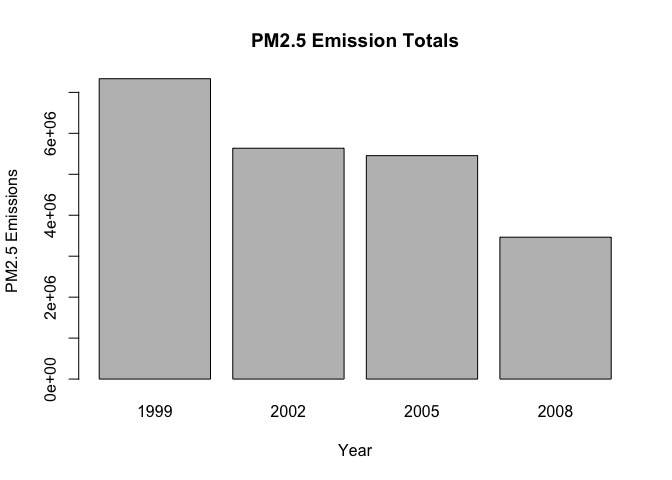
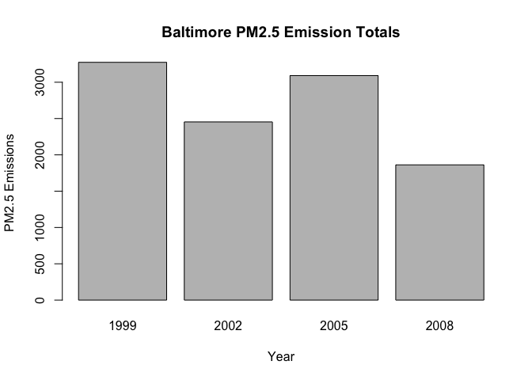
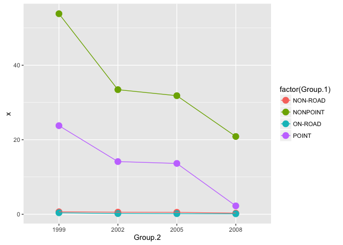
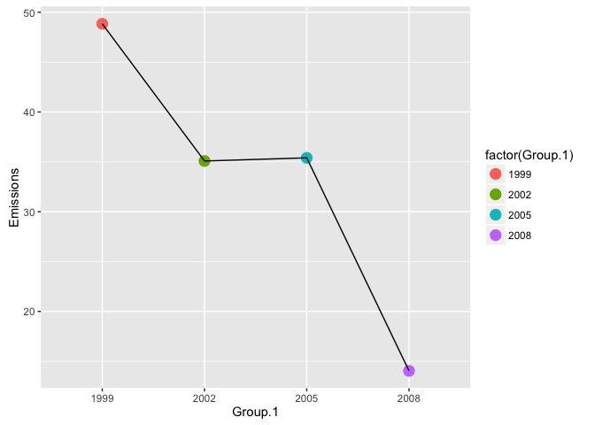
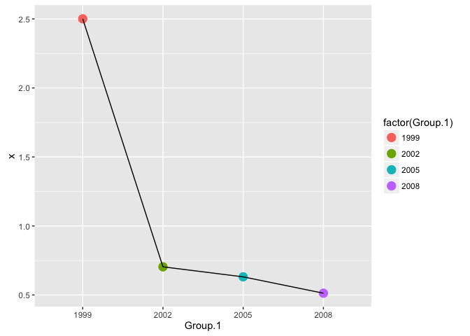

Ryan Tillis - Exploratory Data Analysis - Global Emissions - Coursera
================
<a href="http://www.ryantillis.com"> Ryan Tillis </a>
10/27/2016

Exploratory Data Analysis - Global Active Power
-----------------------------------------------

Have total emissions from PM2.5 decreased in the United States from 1999 to 2008? Using the base plotting system, make a plot showing the total PM2.5 emission from all sources for each of the years 1999, 2002, 2005, and 2008. Upload a PNG file containing your plot addressing this question.

``` r
fileurl = "https://d396qusza40orc.cloudfront.net/exdata%2Fdata%2FNEI_data.zip"
download.file(fileurl, "Summary.zip", method = "curl")
unzip(zipfile = "Summary.zip")
unlink("Summary.zip")
library(ggplot2)
```

``` r
NEI <- readRDS("summarySCC_PM25.rds")
SCC <- readRDS("Source_Classification_Code.rds")

#Factorize SCC and year (not necessary for plotting here but I like doing it.)
NEI <- transform(NEI, SCC = factor(SCC))
NEI <- transform(NEI, year = factor(year))
```

``` r
#Summing emissions by SCC and year
totals <- aggregate(Emissions ~ year,NEI, sum)

barplot(totals$Emissions, xlab="Year", ylab="PM2.5 Emissions", main = "PM2.5 Emission Totals", names.arg = totals$year)
```



Have total emissions from PM2.5 decreased in the Baltimore City, Maryland ( 𝚏𝚒𝚙𝚜 == 𝟸𝟺𝟻𝟷𝟶) from 1999 to 2008? Use the base plotting system to make a plot answering this question.

``` r
#Subsetting to baltimore and totalling by year
balt <- NEI[which(NEI$fips == 24510),]
tbal <- aggregate(Emissions ~ year,balt, sum)

barplot(tbal$Emissions, xlab="Year", ylab="PM2.5 Emissions", main = "Baltimore PM2.5 Emission Totals", names.arg = tbal$year)
```



Of the four types of sources indicated by the 𝚝𝚢𝚙𝚎 (point, nonpoint, onroad, nonroad) variable, which of these four sources have seen decreases in emissions from 1999–2008 for Baltimore City? Which have seen increases in emissions from 1999–2008? Use the ggplot2 plotting system to make a plot answer this question.

``` r
agg_type_year <- aggregate(NEI$Emissions, list(NEI$type, NEI$year),mean)
g <- ggplot(agg_type_year, aes(y=x, x=Group.2))+geom_point(aes(colour = factor(Group.1)), size = 4)
g+geom_line(aes(group=Group.1,colour=Group.1))
```



Across the United States, how have emissions from coal combustion-related sources changed from 1999–2008?

``` r
coal_SCC <- SCC[grep("*coal*|*Coal*",SCC$Short.Name),]$SCC
coal_data <- NEI[NEI$SCC %in% coal_SCC,]

suppressWarnings(agg_coal <- aggregate(coal_data, list(coal_data$year), mean))

g2 <- ggplot(agg_coal, aes(x=Group.1, y=Emissions, group =1)) + geom_point(aes(colour = factor(Group.1)), size = 4)+geom_line()
g2
```



How have emissions from motor vehicle sources changed from 1999–2008 in Baltimore City?

``` r
vehicle_SCC <- SCC[grep("*vehicle*|*Vehicle*",SCC$Short.Name),]$SCC
motor_balt <- balt[balt$SCC %in% vehicle_SCC,]
agg_motor_balt <- aggregate(motor_balt$Emissions, list(motor_balt$year),mean)

g3 <- ggplot(agg_motor_balt, aes(x=Group.1, y=x, group =1)) + geom_point(aes(colour = factor(Group.1)), size = 4)+geom_line()
g3
```



``` r
LA <- NEI[which(NEI$fips == "06037"),]
motor_LA <- LA[LA$SCC %in% vehicle_SCC,]
agg_motor_LA <- aggregate(motor_LA$Emissions, list(motor_LA$year),mean)
agg_motor_LA$city <- rep("LA",4)
agg_motor_balt$city <- rep("Baltimore",4)

two_cities <- rbind.data.frame(agg_motor_balt,agg_motor_LA)

g4 <- ggplot(two_cities, aes(x=factor(Group.1), y=x, group =city)) + geom_point(aes(colour = city), size = 4)+geom_line(aes(colour=city))
g4
```


<hr>
See more at <a href="http://www.ryantillis.com"> my website. </a>

<hr>
